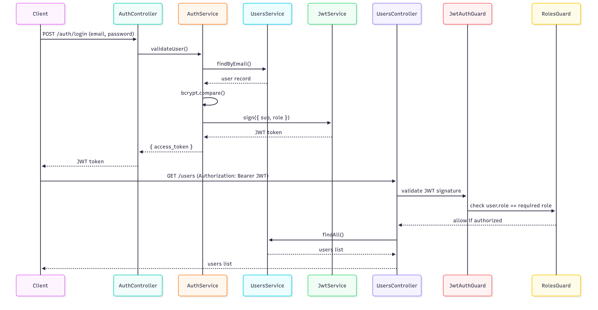

# Backend— NestJSAPI

## 📋Purpose

This package exposes all server‑side capabilities for the Deskbird platform. It is written in TypeScript using NestJS and Sequelize, backed by PostgreSQL.

---

## 🗺️Architecture & Design Highlights

| Area                  | Implementation                                               | Motivation                                                             |
| --------------------- | ------------------------------------------------------------ | ---------------------------------------------------------------------- |
| **ORM**               | Sequelize                                                    | Fine‑grained migration control and wide community adoption.            |
| **Schema migrations** | `sequelize-cli`; `SequelizeMeta` extended with `executed_at` | Version‑controlled DDL, audit‑ready timeline of changes.               |
| **Primary keys**      | UUID(`uuid_generate_v4()`)                                  | Collision‑free across environments, simplifies sharding.               |
| **Indexing**          | Unique index on `users.email`                                | Enforces email uniqueness without redundant indexes.                   |
| **Sync strategy**     | `sequelize.sync()` enabled only for this scoped challenge    | Accelerates local start‑up and testing; disabled in production stacks. |

---

## 🔐Authentication & Authorization

| Concern              | Detail                                 |
| -------------------- | -------------------------------------- |
| **Token type**       | JWT (HS256)                            |
| **TTL**              | 1hour (access token)                  |
| **Password hashing** | bcrypt, `saltRounds = 10`              |
| **RBAC**             | `@Roles()` decorator with `RolesGuard` |

**Why 1‑hour expiry?**
It balances usability and security for the evaluation phase. In production the plan is to introduce short‑lived access tokens plus refresh tokens (see *Next Steps*).

---

## 🔨Database Seeding

```bash
yarn seed ./assets/users.csv
```

The script performs:

1. Schema sync (development only).
2. CSV ingestion (`email`, `password`, `role`).
3. Password hashing via bcrypt.
4. Upsert logic to skip duplicates.

---

## 🧭Auth Workflow (Visual)

A sequence diagram is provided in `assets/auth-diagram.png` illustrating login, token issuance, and guard checks.


---

## 🗺️Next Steps

1. Introduce refresh‑token endpoint with rotation and revocation list.
2. Replace `sequelize.sync()` with pure migrations in all environments.
3. Add integration tests (Jest + Supertest) covering auth, RBAC, and seed logic.
4. Integrate OpenTelemetry tracing and structured logging (pino) for observability.

The backend is intentionally lean, prioritising clear patterns and a secure foundation for future features.

